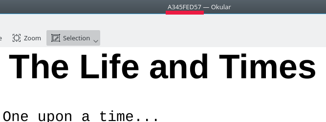
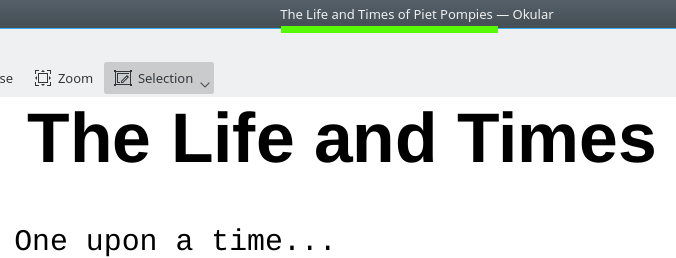

# pdfrename
Use this utility to rename the internal name of a PDF file without having to edit the file with a bespoke PDF editor, and without modifying the system file name either.

Having the correct name of the document displayed in the PDF viewer avoids confusion. Many PDF download sites provide silly internal names to their PDF documents, so even thought the file is name "The Life and Times of Piet Pompies.pdf",
when you open the file in your PDF reader, it shows some bollocks in the title like "A234GE7F", when you would expect it to show "The Life and Times of Piet Pompies" in your PDF reader.

A PDF document that displays its title like this:

...can be made to display it like this:

With this utility, you can bulk-rename entire directories of PDF files to their default file-system name, or you can also set you own internal PDF document title, which you might want to do if you want to embelish the internal title with the author or other publishing details.

# Prerequisites:

You need to have the PDF Toolkit installed, a.k.a. "pdftk". Depending on your Linux distro, use one of the following installation commands:

    yum install pdftk
    equo install pdftk
    apt-get install pdftk
    emerge pdftk

# Usage:

    pdfrename PDF-file

This simplest case: This takes the system file name and sets it as the internal name of the PDF document.

or

    pdfrename PDF-file "The Life and Times of Piet Pompies - Author: Koos Roos, Published 1957"

When you view this file in your PDF viewer, these additional details will also be displayed in the page header.

# More cool stuff you can do:

Use regular expressions to save having to retype the name of the system file name if you want to add or remove text from the internal PDF document title:

    pdfrename PDF-file -e ".* - Author: Koos Roos, Published 1957"

This sets the PDF document title of the file "The Life and Times of Piet Pompies.pdf" to "The Life and Times of Piet Pompies - Author: Koos Roos, Published 1957". Use normal POSIX Basic RegEx (a.k.a. BRE) syntax and remember to use the "-e" option so that RegEx characters are treated as such and to avoid globbing.

To correct all the PDF files in your current working directory to so that they each display their respective system file name, do this to un-taint your collection of PDF books once you have set the correct system file name for each one:

    find . -name "*.pdf" -exec pdfrename {} \; -print

# Health Warning:

- It seems pretty safe to use from where I am sitting.

# Author:

Gerrit Hoekstra. You can contact me via https://github.com/gerritonagoodday

# Environmental Notice:

This work was created from 100%-recycled electrons. No animals were hurt during the production of this work, except when I forgot to feed my cats that one time. The cats and I are on speaking terms again.
